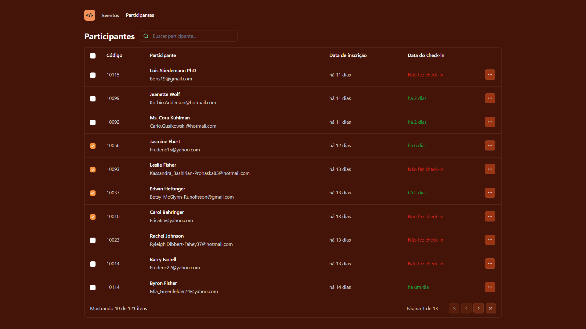

# pass.in
Projeto de gestão de participantes de eventos, focado no dashboard, onde vemos alguns dados dos participantes como nome, e-mail, se já fez check-in, etc.  

Os dados vem de uma [API](<https://github.com/rocketseat-education/nlw-unite-nodejs>) desenvolvida em Node.  
Os dados são fictícios, usando [Faker.js](<https://fakerjs.dev/>)  

## Tecnologias &#9881;
- [React](<https://react.dev/>)  
- [Vite](<https://vitejs.dev/>)  
- [TypeScript](<https://www.typescriptlang.org/>)  
- [Tailwind](<https://tailwindcss.com/>)  
- [tailwind-merge](<https://www.npmjs.com/package/tailwind-merge>)  
- [Lucide](<https://lucide.dev/>)  
- [Day.js](<https://www.npmjs.com/package/dayjs>)  

## Layout final &#127912;
Alterei alguns detalhes visuais do [projeto original](<https://www.figma.com/file/yFWzn4Rl5GWzE1gi12tY0j/pass.in-(Community)?type=design&node-id=2007-1477&mode=design>).  

Projeto desenvolvido na Next Level Week Unite da Rocketseat, trilha de React.